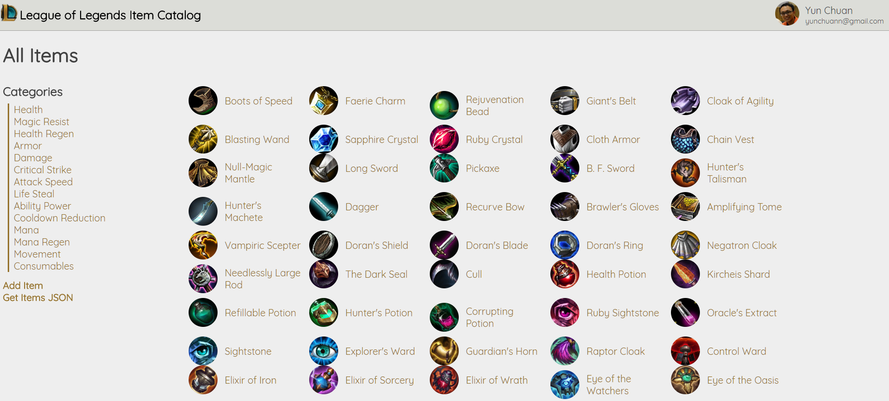

# League of Legends Item Catalog

This project builds a Flask web server that hosts a League of Legends Item Catalog website, backed by a SQLite database. Users can login with Google, add items, edit items & delete items.



## Installation

1. Install the appropriate version of [VirtualBox 5.1](https://www.virtualbox.org/wiki/Download_Old_Builds_5_1) for your operating system.

2. Install the appropriate version of [Vagrant](https://www.vagrantup.com/downloads.html) for your operating system.

    > On Windows, you may need to grant network permissions to Vagrant or make a firewall exception.

3. Clone this repository & add a configuration file `config.py` to the root of the project:

    ```python
    GOOGLE_OAUTH_CLIENT_ID = <Google OAuth Client ID>
    GOOGLE_OAUTH_CLIENT_SECRET = <Google OAuth Client Secret>
    APP_SECRET = 'secret'
    SQLITE_DB_URL = 'sqlite:///lol-item-catalog.db'
    ```

4. `cd` to this project's directory and run:

    ```sh
    vagrant up
    vagrant ssh
    ```

5. You should be now in the virtual machine. `cd` into the project's directory (e.g. `udacity-item-catalog-project).

6. To create the database schema & seed some items to our catalog, run:

    ```sh
    python setup.py
    ```

## Running the Web Server

In the virtual machine, run:

```sh
python app.py
```

You should be able to access the website at http://localhost:5000.
